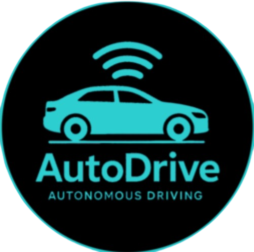

<div align="center">



# AutoDrive

**Autonomous Driving: Pedestrians and Vehicles Detection using YOLOv11**

This project is part of the Data Science and AI Course at Faculty of Electrical Engineering Sarajevo. We utilize the YOLO (You Only Look Once) object detection model to detect pedestrians and vehicles in driving scenarios, classify traffic lights and track lane, primarily using dashcam footage and images. Different configurations and sizes of the YOLO model were explored to evaluate performance.<br>

[](LICENSE)
[](https://github.com/bkosovac1/redziBOT/stargazers)
</div>

## Table of Contents
- [Overview](#overview)
- [Installation](#installation)
- [Datasets](#datasets)
- [Training](#training)
- [Results](#results)
  - [1. Detection - Large YOLOv11 model](#1-detection-with-large-yolov11-model)
  - [2. Detection - Nano YOLOv11 model](#2-detection-with-nano-yolov11-model)
  - [3. Segmentation - Large YOLOv11 model](#3-segmentation-with-large-yolov11-model)
  - [4. Segmentation - Nano YOLOv11 model](#4-segmentation-with-nano-yolov11-model)
- [Poster Presentation](#project-autodrive-poster-presentation)
- [Contributing](#contributing)
- [License](#license)

## Overview

**Team Members:**
* [Emin Hadžiabdić] - ([GitHub Profile](https://github.com/ehadziabdic))
* [Armin Memišević] - ([GitHub Profile](https://github.com/arminn2206))
* [Muhamed Pašić] - ([GitHub Profile](https://github.com/MuhaxD))
* [Bakir Kosovac] - ([GitHub Profile](https://github.com/bkosovac1))
<br><br>

**What to expect in AutoDrive v2:**
* [AutoDrive v1](https://github.com/bkosovac1/redziBOT/releases/tag/v1.0) was accurate but too slow, because it is running 3 models simultaneously on one frame and that is not suitable for real-time applications. In this version we are using 2 models, one for detection and one for segmentation.
* The detection model is used to detect objects in first frame, while the segmentation model is used to segment the lane and road on second frame. This approach is more efficient and allows for real-time applications. 

* But still we are not satisfied with using two frames, in future versions we are going to work on merging all models in one, if it is possible since YOLO is strict when it comes to annotation formatting and merging segmentation and detection tasks, and displaying them on one frame while maintaining real-time performance.

## Installation

Clone the repository:
```bash
git clone https://github.com/bkosovac1/redziBOT
```
or clone on Replit:<br>
[](https://replit.com/new/github/bkosovac1/redziBOT)

## Datasets

[Detection Model](https://universe.roboflow.com/autodrivemodels/autodrive-v2/dataset/2)<br>
The dataset used for training and evaluation of detection model is available on RoboFlow. It consists of approximately 16,346 frames of classes relevant to this project: `green-light`, `red-light`, `yellow-light`, `pedestrian`, `car`, `truck`, `bus`, `motorbike`, `bicycle`.

[Segmentation Model](https://universe.roboflow.com/autodrivemodels/lane-segmentation-5yla7-trsxa/dataset/3)<br>
The dataset used for training and evaluation is available on RoboFlow. It consists of approximately 1927 frames capturing roads and side-lines. Classes are `lane` and `road`. We used same model in version 1

## Training 
Training was done on nano and large size of YOLOv11 model. The training process was optimised with recommended optimizer for that specific dataset.
Following are the training parameters and results of all models. 
Training was conducted using various sizes of the YOLOv11 model (`nano` and `large`). Key training parameters and validation results are summarized below:

|      **Model**       | **YOLO Size** | **Epochs** | **Batch Size** | **Learning Rate** |  **Optimizer**  | **Momentum** |  **Dropout**  | **Precision (P)** | **Recall (R)** | **mAP50** | **mAP50-95** |
|:--------------------:|:-------------:|:----------:|:--------------:|:-----------------:|:---------------:|:------------:|:-------------:|:-----------------:|:--------------:|:---------:|:------------:|
|   Detection Model    |    `large`    |    `10`    |      `16`      |     `0.001429`    |  `Auto: AdamW`  |     `0.9`    |     `0.0`     |      `81.1%`      |     `68.4%`    |  `75.5%`  |    `44.2%`   | 
|   Detection Model    |    `nano`     |    `25`    |      `32`      |     `0.001429`    |  `Auto: AdamW`  |     `0.9`    |     `0.0`     |      `81.1%`      |     `65.6%`    |  `72.9%`  |    `41.9%`   | 
|  Segmentation Model  |    `large`    |    `50`    |      `16`      |     `0.001667`    |  `Auto: AdamW`  |     `0.9`    |     `0.0`     |      `83.2%`      |     `86.4%`    |  `85.8%`  |    `77.2%`   | 
|  Segmentation Model  |    `nano`     |    `100`   |      `64`      |     `0.001667`    |  `Auto: AdamW`  |     `0.9`    |     `0.0`     |      `82.9%`      |     `88.9%`    |  `86.8%`  |    `78.7%`   |


## Results
Below are some key performance indicators and visualizations from our training runs.


### 1. Detection with Large YOLOv11 model

* **Precision-Confidence Curve:**

    

* **Recall-Confidence Curve:**

    

* **Precision-Recall Curve:**

    

* **Confusion Matrix:**

    

* **Results:**

    


### 2. Detection with Nano YOLOv11 model

* **Precision-Confidence Curve:**

    

* **Recall-Confidence Curve:**

    

* **Precision-Recall Curve:**

    

* **Confusion Matrix:**

    

* **Results:**

    


### 3. Segmentation with Large YOLOv11 model

* **Precision-Confidence Curve:**

    

* **Recall-Confidence Curve:**

    


* **Precision-Recall Curve:**

    

* **Confusion Matrix:**

    

* **Results:**

    


### 4. Segmentation with Nano YOLOv11 model

* **Precision-Confidence Curve:**

    

* **Recall-Confidence Curve:**

    

* **Precision-Recall Curve:**

    

* **Confusion Matrix:**

    

* **Results:**

    

## Project: AutoDrive Poster Presentation
**Poster Presentation**
    

## Contributing
Pull requests are welcome. For major changes, please open an issue first to discuss what you would like to change.

## License
This project is licensed under the MIT License. See the [LICENSE](LICENSE) file for details.
